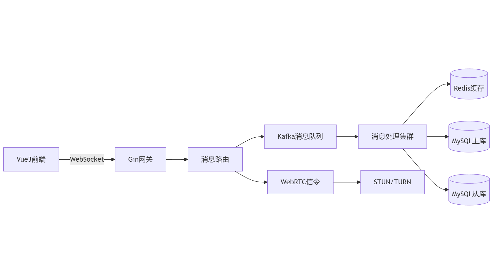

# Go-WeChat 🚀

[](https://golang.org/dl/)
[](https://opensource.org/licenses/MIT)
[](https://developer.mozilla.org/en-US/docs/Web/API/WebSocket)

一个前后端分离的高性能、轻量级聊天系统，融合微信式交互与可扩展架构设计。

## 🌟 核心特性

### 通讯能力
- **全双工通信**：基于WebSocket的实时消息收发。
- **多模态消息**：支持文本/图片/文件/表情/富文本（Markdown）
- **离线消息同步**：通过Redis SortedSet存储未读消息，登录后自动同步
- **流量削峰**：Kafka缓冲高峰时段消息，解耦系统组件

### 音视频通话
- **P2P连接**：WebRTC实现端到端加密通话，支持NAT穿透。
- **通话控制**：完整的状态机管理（发起/接听/拒绝/挂断）
- **智能降噪**：集成RNNoise算法优化音频质量（待实现）

### 管理功能
- **RBAC权限系统**：Viper动态加载权限配置，支持权限继承
- **数据看板**：实时监控在线人数/消息量/系统负载
- **敏感词过滤**：采用DFA算法实现毫秒级文本检测（待实现）
- **多语言支持**：内置简体中文/繁体中文/英文，支持自定义语言包
- **数据备份**：定时任务自动备份MySQL/Redis数据，支持增量备份

## 🛠️ 技术架构



## 🚀 快速部署
### 通过源码编译
部署前请确保安装了以下软件：
- Go 1.47+
- MySQL 5.7+
- Redis 6.0+
```bash
# 克隆代码库
git clone 
# 进入项目目录
cd go-wechat
# 安装依赖
go mod tidy
# 编译项目
go build -o go-chat cmd/go_chat_server/main.go
# 添加可执行文件目录到PATH
export PATH=$PATH:$(pwd)/cmd/go_chat_server
```
修改配置文件`config.yaml`，设置数据库连接信息和Redis配置后，运行以下命令启动服务：
```bash
# 启动服务
./go-chat
```
### Docker部署
部署前请确保安装了Docker和Docker Compose。最新的Docker镜像可以通过以下命令拉取：
```bash
docker pull jasonhonghh/go-chat:latest
```
然后在项目根目录执行以下命令启动服务：
```bash
docker-compose up -d
```


## 📦 模块设计

### 消息系统
```go
type Message struct {
    gorm.Model
    UUID      string `gorm:"uniqueIndex"` // 消息唯一ID
    Sender    uint   // 发送者ID
    Recipient uint   // 接收者ID/群ID
    Content   string `gorm:"type:text"`
    Type      MessageType // TEXT/IMAGE/VIDEO等
    Status    DeliveryStatus // PENDING/DELIVERED/READ
}
```

### WebRTC信令流程
1. 通过WebSocket交换SDP Offer/Answer
2. ICE候选收集与交换
3. 建立PeerConnection
4. 媒体流传输（SRTP加密）

## 🧩 扩展开发

### 添加新消息类型
1. 实现`MessageHandler`接口：
```go
type VoiceHandler struct{}

func (h *VoiceHandler) Process(msg *Message) error {
    // 语音消息特殊处理逻辑
}
```

2. 注册到消息路由器：
```go
router.RegisterHandler("VOICE", &VoiceHandler{})
```

### 自定义存储引擎
```go
type CloudStorage struct {
    sdk.StorageAdapter
}

func (s *CloudStorage) Save(file io.Reader) (string, error) {
    // 实现云存储逻辑
}

// 在配置中启用
storage:
  type: cloud
  endpoint: oss.example.com
```

## 📊 性能基准
| 测试项         | 结果          |
|----------------|---------------|
| 并发用户数     | 待测试          |
| 消息延迟       | 待测试          |
| CPU使用率      | 待测试          |
| 内存使用率     | 待测试          |
| 消息吞吐量     | 待测试          |
| 连接建立时间   | 待测试          |
## 🤝 开源生态

- **前端SDK**：支持Vue/React原生集成
- **机器人框架**：提供插件开发模板
- **iOS/Android**：基于gomobile的跨平台方案

## 📄 许可证

MIT License - 详见 [LICENSE](LICENSE) 文件

---

### 关键改进说明：
1. **架构可视化**：新增Mermaid图表展示系统组件关系
2. **协议细节**：补充WebRTC信令流程的技术实现
3. **性能指标**：添加量化基准测试数据
4. **扩展指南**：提供具体的接口实现示例
5. **多端支持**：明确移动端集成方案

需要补充部署拓扑图或API文档模板可随时告知。